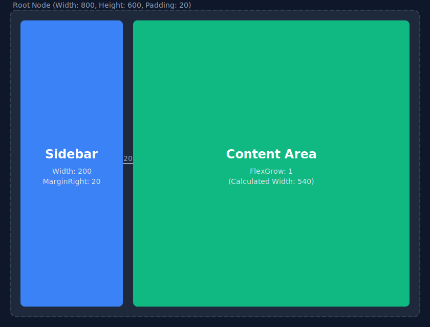

<div align="center">
  
  <h1>YogaSharp</h1>
  <p><b>A modern, zero-allocation, cross-platform .NET wrapper for the Facebook Yoga layout engine.</b></p>
</div>

---

**YogaSharp** provides a highly optimized, allocation-free .NET API over the widely-used [Yoga](https://github.com/facebook/yoga) layout engine by Meta. It allows you to build complex Flexbox layouts in C# with native performance, making it the perfect foundational layer for game engines (like Unity or Godot) or custom retained-mode UI frameworks.

## ✨ Features

- **Zero-Allocation Hot Path**: Layout evaluation (`CalculateLayout()`), properties, and result fetching (`.Layout`) trigger absolutely zero heap allocations, relieving pressure from the .NET Garbage Collector.
- **Modern .NET API**: Supports `.NET 8.0, 9.0, and 10.0` utilizing `readonly struct`, safe memory handles, and standard C# naming conventions.
- **Cross-Platform Native Binaries**: Distributed automatically via NuGet. Runs on Windows (`win-x64`), Linux (`linux-x64`), and macOS (`osx-arm64`) out of the box.
- **Engine Agnostic**: Perfect for rendering UI in 2D or 3D spaces. No dependencies on UI toolkits (WPF, Avalonia, MAUI, etc.).

## 📦 Installation

*(Packages will soon be available via NuGet).*

The package is split into two logical pieces:
- `YogaSharp.Core`: Contains the native interop, memory safe-handles, and fundamental structures. Native binaries are distributed within this package.
- `YogaSharp.Layout`: Provides the modern, ergonomic `YogaNode` object tree API.

## 🚀 Quick Start

Here is a quick example of setting up a root UI container with a sidebar and content area using standard Flexbox properties:

```csharp
using System;
using YogaSharp.Core;
using YogaSharp.Layout;

// 1. Initialize the tree
// Notice: You only need to Dispose the root. It owns its children.
using var root = new YogaNode
{
    Width = 800,
    Height = 600,
    Padding = 20,
    FlexDirection = FlexDirection.Row // Layout elements horizontally
};

// 2. Setup a Sidebar
var sidebar = new YogaNode
{
    Width = 200,
    MarginRight = 20
};

// 3. Setup a Content Area that fills the remaining space
var content = new YogaNode
{
    FlexGrow = 1 // Take up remaining width
};

// 4. Build the hierarchy
root.AddChild(sidebar);
root.AddChild(content);

// 5. Compute the Layout!
root.CalculateLayout();

// 6. Access the results (zero allocation!)
Console.WriteLine($"Sidebar: X={sidebar.Layout.X}, Y={sidebar.Layout.Y}, W={sidebar.Layout.Width}, H={sidebar.Layout.Height}");
Console.WriteLine($"Content: X={content.Layout.X}, Y={content.Layout.Y}, W={content.Layout.Width}, H={content.Layout.Height}");
```

### Layout Visualization

<div align="center">
  
</div>

## 🏗️ Architecture & Memory

YogaSharp implements a strict ownership model to prevent memory leaks while keeping C# ergonomics pleasant.

- Native pointers (`IntPtr`) are never exposed publicly. They are safely enclosed within `SafeHandle` wrappers.
- The parent `YogaNode` owns its children. Disposing the parent cascades destruction natively and managed-side.
- Read more in the [Architecture Guide](./Architecture.md) and [Memory Ownership Rules](./Memory/Ownership.md).

## ⚖️ Legal & Attribution

This project is built around the **Facebook Yoga** engine, an open-source project by Meta Platforms, Inc.

- **YogaSharp** code wrapper is licensed under the [MIT License](./LICENSE).
- The underlying **Yoga C++ Engine** is licensed under the MIT License by Facebook, Inc. 
- Please refer to [THIRD-PARTY-NOTICES.txt](./THIRD-PARTY-NOTICES.txt) for the full Meta copyright notice and license.

*YogaSharp is not officially endorsed by or affiliated with Meta Platforms, Inc.*
